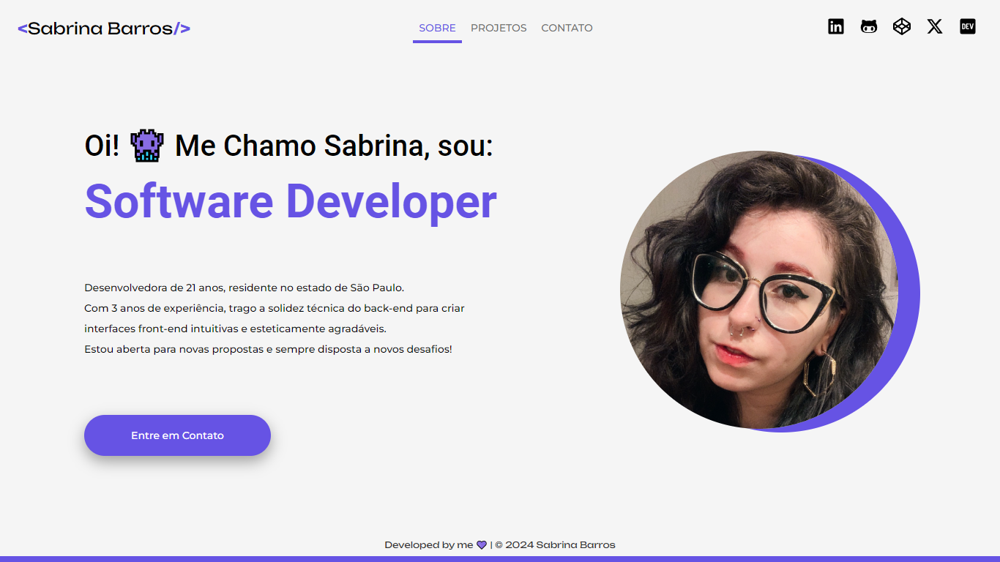

# [sabrinabarros.github.io](https://sabrinabarros.github.io)

My personal Website. 🚀



This project was started with **Vite** and developed using **React ecosystem**.

## Development 🔧

### Getting started

- Clone this repository:

```shell
$ git clone git@github.com:<your-username>/kadabra.git
```
```shell
$ cd sabrinabarros.github.io
```

- And install all dependencies:

```shell
$ npm install
```

- Start the project:

```shell
$ npm run dev
```

## Contributing 💌

If you would like to contribute to the project, feel free to check the [contributing](CONTRIBUTING.md) file for more information.

## License 📃

[MIT License](./LICENSE) © [Sabrina Barros](https://github.com/SabrinaBarros)